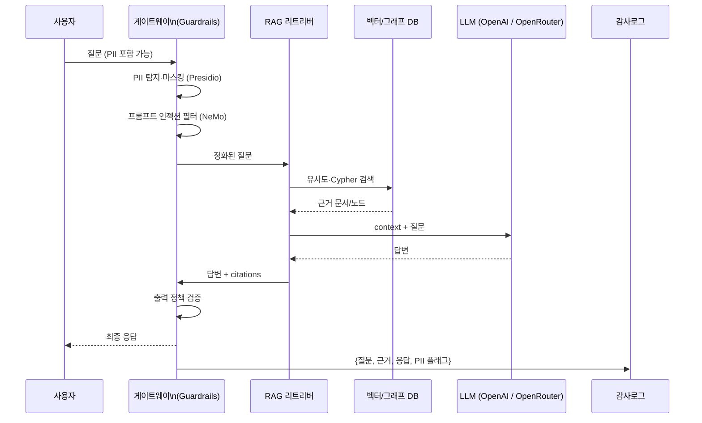

# LLM 서비스 참조 아키텍처 (OpenRouter 경유 OpenAI)

## 1. 구성 계층

```mermaid
flowchart LR
    subgraph CLIENT["👥 사용자"]
        U[내부 사용자]
    end

    subgraph APP["💠 애플리케이션"]
        GW[게이트웨이\n(Guardrails + 감사)]
        RAG[RAG 서비스\nChroma/FAISS]
        KG[Neo4j\nGraphRAG]
    end

    subgraph CLOUD["☁️ OpenAI / OpenRouter"]
        LLM[ChatOpenAI\nopenai/gpt-4o-mini]
        EMB[Embeddings\ntext-embedding-3-small]
    end

    U --> GW
    GW --> RAG
    RAG --> LLM
    RAG --> KG
    RAG --> EMB
    GW --> LLM
```

## 2. 데이터 흐름 (질의 → 응답)



## 3. 환경변수 연결

| 변수 | 용도 |
|---|---|
| `OPENAI_API_KEY` | OpenAI 또는 OpenRouter API 키 |
| `OPENAI_API_BASE` | OpenRouter 사용 시 `https://openrouter.ai/api/v1` |
| `OPENAI_MODEL` | `openai/gpt-4o-mini` 같은 모델 경로 |
| `OPENAI_EMBEDDING_MODEL` | `openai/text-embedding-3-small` |
