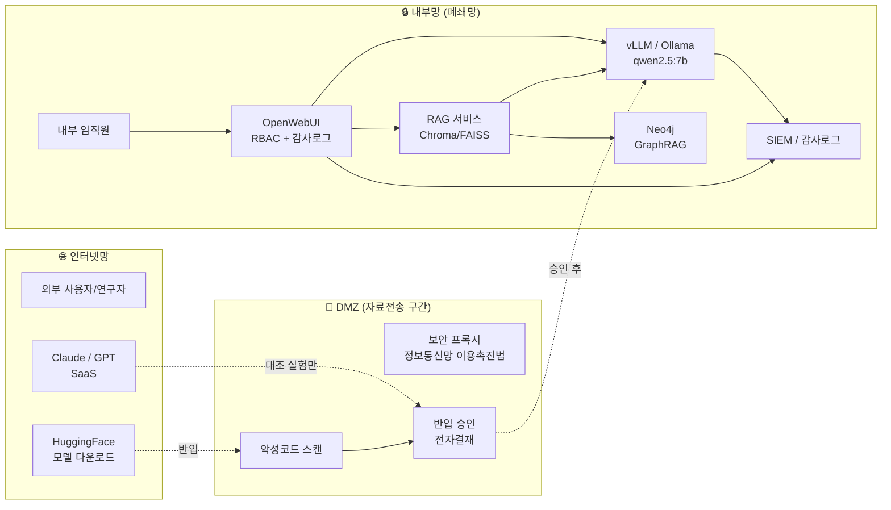
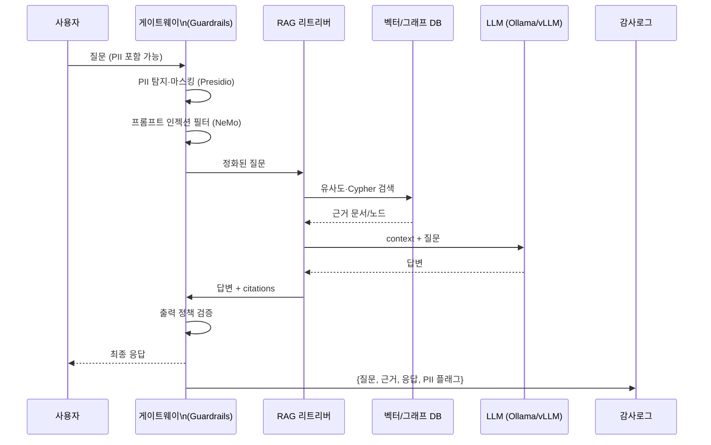

# 폐쇄망 LLM 서비스 참조 아키텍처

## 1. 망분리 기반 3계층 구조



## 2. 데이터 흐름 (학습/운영 분리)



## 3. 모델/패키지 반입 절차

```mermaid
flowchart TD
    A[외부망\nollama pull] --> B[GGUF 파일\nSHA256 계산]
    B --> C[승인 신청\n(모델명, 용도, 책임자)]
    C --> D{승인}
    D -->|거절| X[반입 중단]
    D -->|승인| E[USB/전송매체]
    E --> F[DMZ 스캐너\n악성코드 검사]
    F --> G[내부망 Ollama 서버\nSHA256 재검증]
    G --> H[Modelfile 등록]
    H --> I[운영 배포]
```
