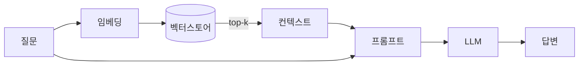
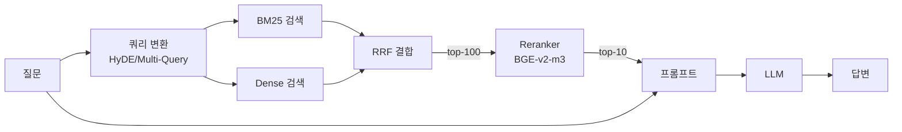
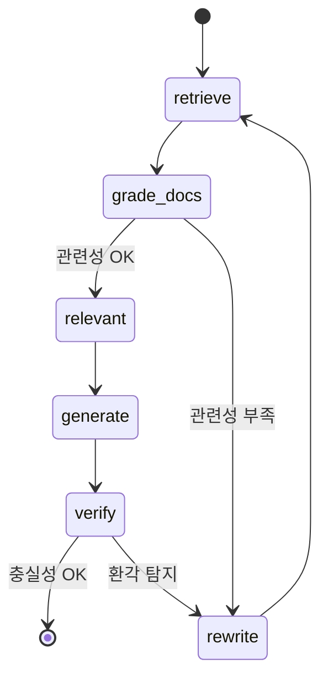
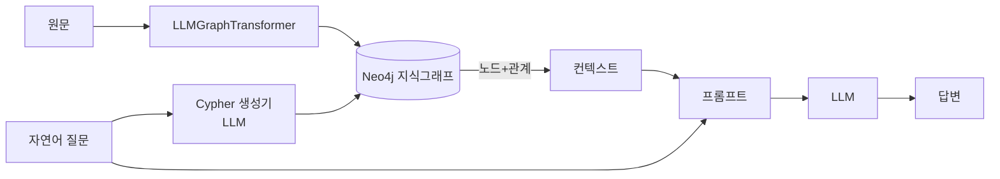

# RAG 파이프라인 비교 (기본 → Advanced → GraphRAG)

## 1. 기본 RAG (Day 1 S2)

## 2. Advanced RAG (Day 2 S3) — Hybrid + Rerank + Query Transform

## 3. Self-RAG / CRAG (LangGraph 상태기계)

## 4. GraphRAG (Day 2 S3-6)

